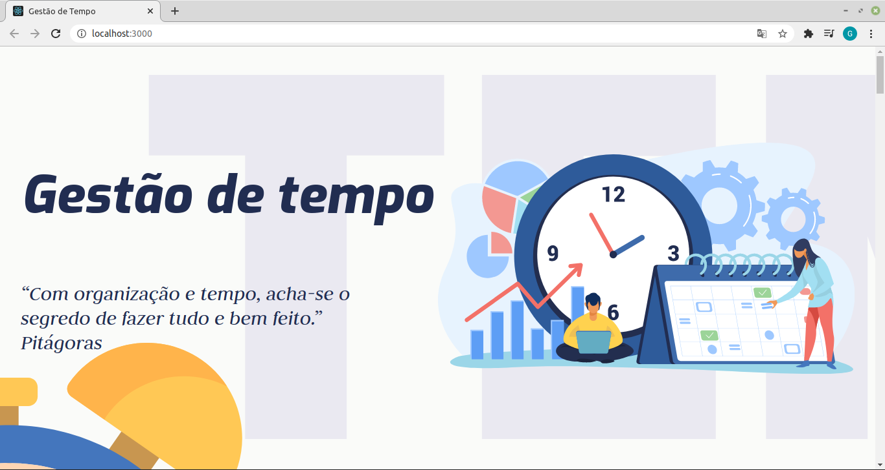
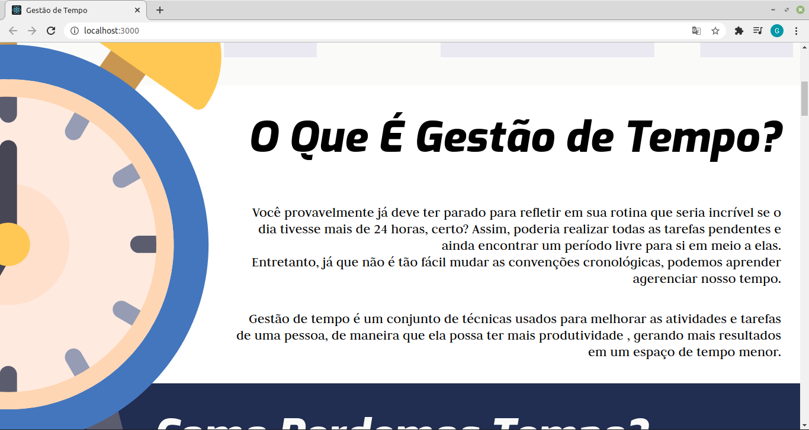
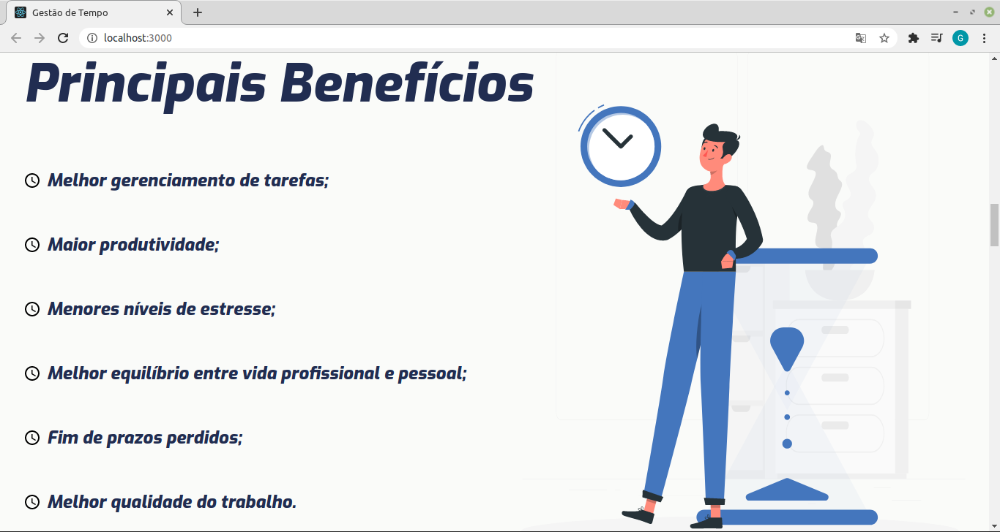
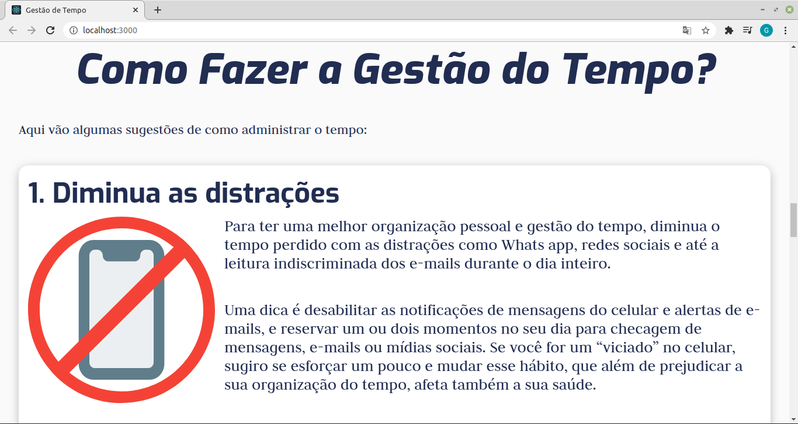
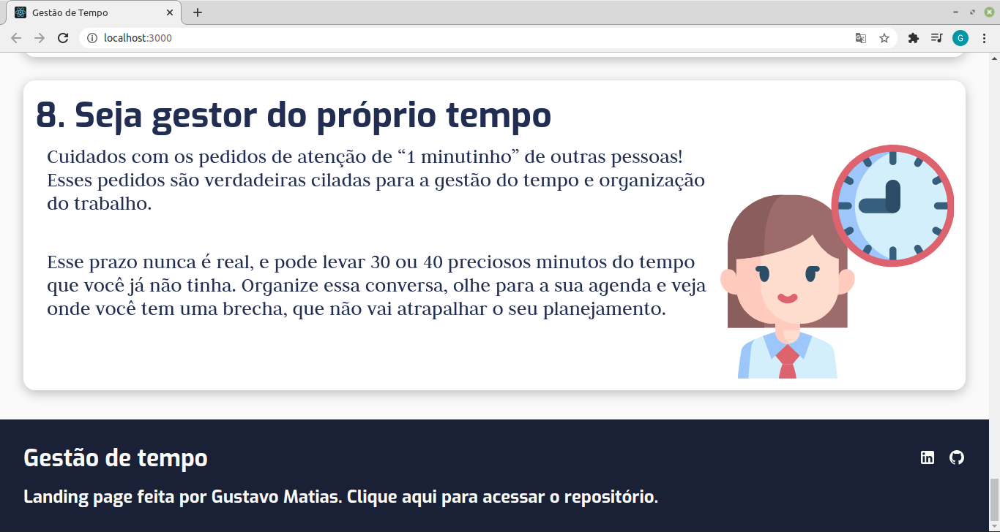

# Expansion Week - Desafio

## Proposta

A proposta do desafio da Expansion Week é criar uma landing page, onde iremos falar sobre uma soft skill que você considera a mais importante para devs.

## Gestão de tempo

Uma pessoa desenvolvedora precisa de tempo para solucionar problemas, aplicar testes, interagir com os clientes, ajudar outros desenvolvedores de sua equipe, escrever códigos e manter-se atualizado sobre as novidades que surgem todo dia (como, por exemplo, um framework JavaScript). E só a partir de um bom gerenciamento de tempo é possível lidar com essa rotina intensa, e é por isso que a considero como a soft skill mais fundamental para devs.

## Imagens

## Observações

- A página está otimizada para telas com resolução 1366x768, que é a resolução de tela mais usada pelos brasileiros.

## Próximos passos

- [ ] Responsividade para tablet/mobile;

- [ ] Header;

- [ ] Botão para voltar ao topo.

## Como executar o projeto

- Fazer o clone desse repositório;
- Na pasta criada, executar no terminal:
  `yarn` ou `npm install`;
- Executar o comando:
  `yarn start` ou `npm run start`;
- Abrir o seu browser favorito e digitar o endereço `http://localhost:3000`.
