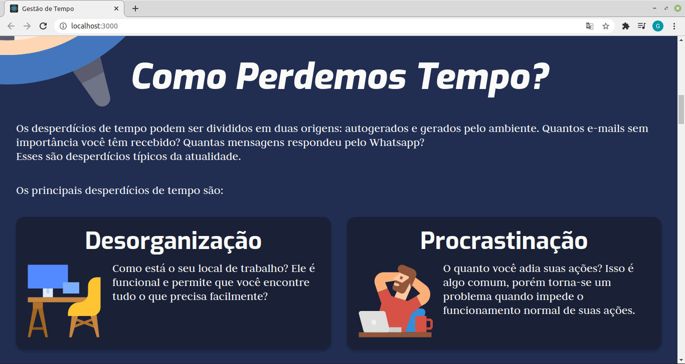

# Expansion Week - Desafio

## Proposta

A proposta do desafio da Expansion Week é criar uma landing page, onde iremos falar sobre uma soft skill que você considera a mais importante para devs.

## Gestão de tempo

Uma pessoa desenvolvedora precisa de tempo para solucionar problemas, aplicar testes, interagir com os clientes, ajudar outros desenvolvedores de sua equipe, escrever códigos e manter-se atualizado sobre as novidades que surgem todo dia (como, por exemplo, um framework JavaScript). E só a partir de um bom gerenciamento de tempo é possível lidar com essa rotina intensa, e é por isso que a considero como a soft skill mais fundamental para devs.

## Imagens

## Observações

- A página está otimizada para telas com resolução 1366x768, que é a resolução de tela mais usada pelos brasileiros.

## Próximos passos

- [ ] Responsividade para tablet/mobile;

- [ ] Header;

- [ ] Botão para voltar ao topo.

## Como executar o projeto

- Fazer o clone desse repositório;
- Na pasta criada, executar no terminal:
  `yarn` ou `npm install`;
- Executar o comando:
  `yarn start` ou `npm run start`;
- Abrir o seu browser favorito e digitar o endereço `http://localhost:3000`.

## Referências

### Texto

- https://andrebona.com.br/5-ferramentas-de-gestao-de-tempo-que-vao-mudar-a-sua-vida/
- https://blog.uceff.edu.br/conheca-7-ferramentas-de-gestao-de-tempo-para-melhorar-sua-rotina/
- https://ead.ucs.br/blog/gestao-tempo
- https://robsoncamargo.com.br/blog/8-tecnicas-de-gestao-do-tempo-e-produtividade

### Imagens

- https://www.freepik.com/free-vector/timing-project-scheduling_6976404.htm
- https://www.flaticon.com/free-icon/alarm-clock_185990
- https://www.flaticon.com/free-icon/workstation_2807224?term=workspace&page=1&position=5
- https://www.flaticon.com/free-icon/relax_3063835?term=procrastination&page=1&position=1
- https://www.flaticon.com/free-icon/chat_3473462?term=yes&page=1&position=66
- https://www.flaticon.com/free-icon/gmail_2991144?term=social&page=1&position=44
- https://www.flaticon.com/free-icon/instagram_1384063?term=social&page=1&position=6
- https://www.flaticon.com/free-icon/youtube_1384060?term=social&page=1&position=9
- https://www.flaticon.com/free-icon/facebook_733547?term=social&page=1&position=10
- https://www.flaticon.com/free-icon/whatsapp_733585?term=social&page=1&position=14
- https://www.flaticon.com/free-icon/instagram_2111463?term=social&page=1&position=1
- https://www.flaticon.com/free-icon/tik-tok_3046121?term=tiktok&page=1&position=2
- https://www.freepik.com/free-vector/time-management-concept-illustration_7079479.htm#page=1&query=time%20management&position=22
- https://www.flaticon.com/free-icon/twitter_145812?term=twitter&page=1&position=3
- https://www.flaticon.com/free-icon/no-smartphones_2313727?term=no%20mobile&page=1&position=10
- https://www.flaticon.com/free-icon/time-planning_1587115?term=planning&page=1&position=13
- https://www.flaticon.com/free-icon/notebook_784856?term=agenda&page=1&position=1
- https://www.flaticon.com/free-icon/thinking_599422?term=thinking%20bubble&page=1&position=4
- https://www.flaticon.com/free-icon/victim_3622040?term=focus&page=1&position=2
- https://www.flaticon.com/free-icon/calendar_3079014?term=calendar&page=1&position=9
- https://www.flaticon.com/free-icon/employee_3094789
